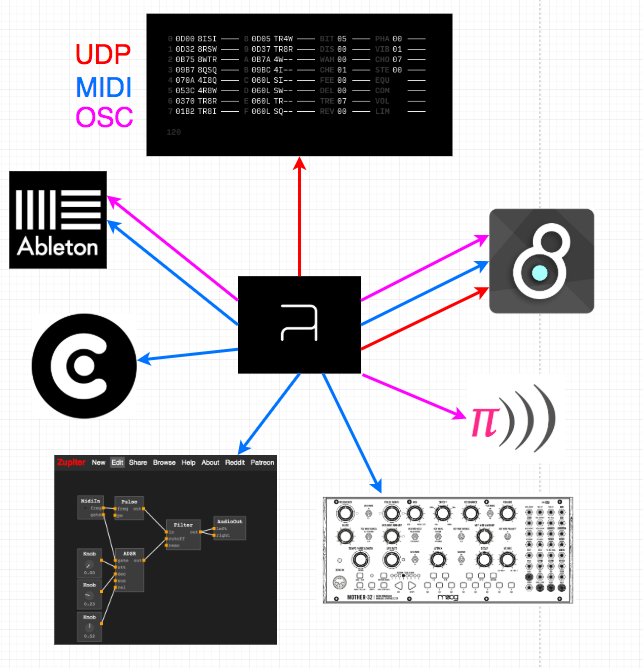

# ORCA_Code-Share_Workshop
## Setup
You can download [builds](https://hundredrabbits.itch.io/orca) for **OSX, Windows and Linux**, or if you wish to build it yourself, follow these steps:

- If you have Git, open up your terminal, or command-prompt(CMD).

```
git clone https://github.com/hundredrabbits/Orca.git
cd Orca/desktop/
npm install
npm start
```

or...

Go to their Website https://hundredrabbits.itch.io/orca, and download your corresponding build.


you can always open up Orca by running the terminal and typing in

```
cd Orca/desktop/
npm install
npm start
```

## What is Orca?


## How to manuever

- use the arrowkeys to move around the map
- "space-bar" to play or pause Orca
- (cmd/ctrl) + g = help overlay

## Hello World (using Pilot)


Orca and Pilot can communicate with each other using UDP messages. These are symbolised with ";" in Orca. in this instance i have assigned the UDP-message with 3 parameters.

RED = UDP channels (0,1,2,3,4,5,6,7,8,9,A,B,C,D,E,F)

GREEN = Note value (2C = second octave, middle C)

BLUE = Bang! = "*" = Activates the message = micro compiling

## Basic Operators

### Number-Operands

- **A** = adding to parameters


- **C** = counter


###Bang-Operands

- **D** = Bang, different speeds


- **F** = if (equal) statement, then Bang


### Flow-Operands

- **J** = Jumber (vertical)


- **Y** = Yumber (horisontal)


- **G** = write multiple operands at offset coordinates


- **X** = write operand with offset


**H** = Halts southward operand


## Copy, Paste, Delete Algorithms with Orca

- press shift + arrowkeys to make a larger selection
- press shift + (cmd/ctrl)+arrowkeys to make a larger selection faster
- use (cmd/ctrl)+c and (cmd/ctrl)+v, as per usual to copy and paste your algorithms
- use backspace to delete algorithms


## Connect Orca with?



### Free

- Pilot


- Zupitor web browser modular synth

- VCV Rack

### Not-free

- Max/MSP
- Ableton/ any DAW
- External Hardware Synths with Midi-inputs

### Ways of Communicating


- UDP = Pilot, Max/MSP
- MIDI = External Hardware, Ableton, VCV Rack, Zupitor, Max/MSP...
- OSC = Sonic Pi, Max/MSP

## Example Code

https://vimeo.com/359025238

...1R8........
34L31375TADQsW
..3J.J..Q.....
58X3F3H.J.....
....*xS.Q.....
.....S..J.....
........Q.....
........J.....
........Q.....
........J.....
........Q.....
.....*..J.....
.....:03Q.....

## Sources

- https://z.musictools.live/
- https://vcvrack.com/
- https://github.com/hundredrabbits/Orca
- https://github.com/hundredrabbits/pilot
- https://www.youtube.com/watch?v=RaI_TuISSJE&t=9s
- https://www.youtube.com/watch?v=CR1TMGYhCoE&t=2s
